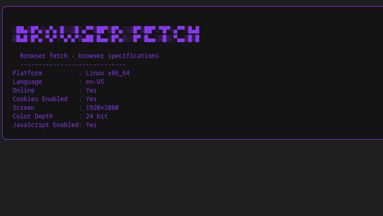

# browser-fetch



### ✨ What is it?
**browser fetch** is a tool to display your specification of web browser, or just for fun!


### 📁 How to Use
**save** file "browser-fetch" . html and run in web browser, else you can clone it:
   ```bash
   git clone https://github.com/xaphentos/browser-fetch.git
   cd browser-fetch
   ```
### Customization
you can modify background color and other.

If you like this project you may put star! 🌟

###This project link:

https://github.com/xaphentos/browser-fetch
